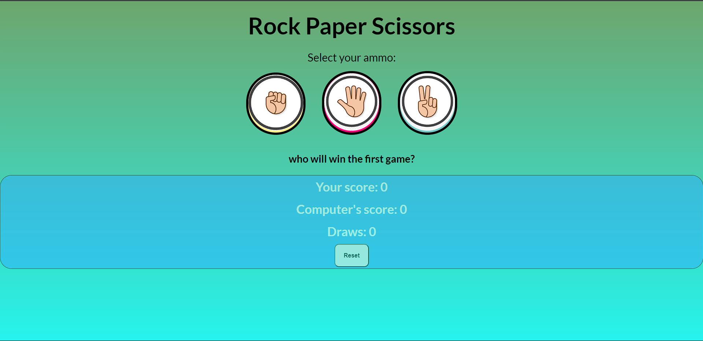

# ✊✋✌️ Rock Paper Scissors Game

A simple and interactive Rock Paper Scissors game built using **HTML**, **CSS**, and **JavaScript**. Play against the computer and see who wins!

## 🔗 Live Demo

[Click here to play]([https://yogesh507.github.io/Rock-Paper-Scissors-Game/])  

---

## 🎮 How to Play

- Click on either **Rock**, **Paper**, or **Scissors**.
- The computer will randomly choose its move.
- The winner will be decided based on traditional rules:
  - Rock beats Scissors
  - Paper beats Rock
  - Scissors beats Paper
- Score is updated after each round.

---

## 🛠️ Tech Stack

- **HTML5**
- **CSS3**
- **JavaScript **

---

# Screenshot

